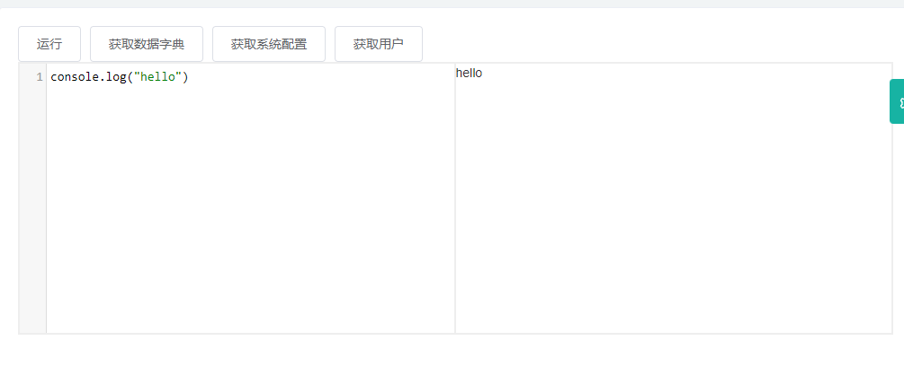

# cassie_axum

#### 介绍
基于rust axum 完成web端手脚架 基础权限,用户,缓存,验证,代码生成

rust axum web 是rust开发的web手脚架项目
前端项目 https://gitee.com/stringlxd/cassie_admin

#### 项目讲解
B站：
https://space.bilibili.com/480402847?spm_id_from=333.788.b_765f7570696e666f.1
#### 软件架构

软件架构说明

1. rust web框架
2. web:axum
3. 数据库:mysql
4. Orm:Ribatis
5. RBAC:cabin-rs
6. 验证码:captcha
7. 数据验证:validator

#### 开发计划

1. 基础缓存定义,ORM框架定义
2. 返回数据格式定义
3. 完成casbin的基础RABC权限集成
4. TODO 微服务集成 KONG网关集成
5. nacos注册中心集成
6. 动态表单实现
7. 微信小程序工具集开发
8. 租户化实现
9. javascript动态脚本集成

#### 已完成

1. 基础缓存定义,redis
2. orm框架选用Ribatis
3. casbin-rs集成,适配器编写
4. 用户权限jwt 融合casbin-rs
5. 完成nacos注册和心跳集成
6. 动态表单实现
7. 租户化实现
8. javascript动态脚本集成
9. 自定义javascript playground

#### 使用说明

 1. 初始化DB，添加配置
   导入db/cassie_admin.sql文件
   配置application.yml
 2. 构建并启动项目
   cargo build
   cago run
 3. 启动前端项目https://gitee.com/stringlxd/cassie_admin
    默认端口 9999


#### 目录结构
```
cassie_axum
├─ Cargo.toml                   //核心包配置
├─ cassie_casbin_adapter                 
├─ cassie_common                
├─ cassie_ops   //操作 宏定义
├─ cassie_config
├─ cassie_domain
├─ cassie_orm
├─ cassie_macros
├─ cassie_wx
├─ cassie_storage
├─ cassie_web
│  ├─ application.yml
│  ├─ auth_config
│  │  └─ rbac_with_domains_model.conf
│  ├─ Cargo.toml
│  └─ src
│     ├─ admin      //后台管理resource核心实现
│     │  ├─ asi    //动态表单相关
│     │  └─ sys     //系统相关
│     ├─ api
│     ├─ cici_casbin  //casbin 实现
│     ├─ config
│     ├─ initialize   //系统启动初始化相关
│     ├─ interceptor//租户拦截器
│     ├─ lib.rs
│     ├─ main.rs
│     ├─ middleware      //中间件实现
│     ├─ nacos
│     │  └─ mod.rs
│     ├─ observe         //event 核心实现
│     ├─ routers  
│     │  ├─ admin.rs     //管理端路由
│     │  ├─ api.rs       //api路由
│     └─ service         //service核心包
├─ LICENSE
└─ README.md

```

#### 框架说明
管理员账号:admin/123456
测试账号:lixingdong1/123456
1. https://casbin.org/docs/zh-CN/overview
2. https://rbatis.github.io/rbatis.io/#/
3. https://axum.rs/
4. https://github.com/denoland/rusty_v8
5. https://github.com/denoland/deno

#### 参与贡献

String <348040933@qq.com>
交流群:435604279

感谢Ribatis作者

#### 提示
代码每天都在更新,大家每天及时更新
#### 更新日志
2022.5.30
event事件宏定义
开发者无需关注事件如何发送触发
只需要在数据库里配置响应脚本即可
```rust
///api_operation event_bus触发器
/// #[api_operation("result=false")] 返回值为Result类型 默认是true   false 
/// #[api_operation("return=true")]  是否传递返回值 到jsRuntime里面 默认是不开启的
/// #[api_operation("result=false|return=true")]多参数同时使用
#[api_operation]
pub async fn nav() -> impl IntoResponse {
    let request_model = get_local().unwrap();
    let vo = get_user_menu_list(request_model.uid().clone().to_string(), request_model.super_admin().clone(), request_model.agency_code().clone()).await;
    vo
}
```
2022.5.16
完成js playground开发

```renderscript
//获取数据字典     
let  data = Cassie.getAllDict();
for(let i=0;i<data.length;i++){
console.log("name:"+data[i].dict_name);
//获取系统配置
let  data = Cassie.getConfig();
console.log(data.redis_url);
//根据id获取用户
let  data = Cassie.getUserById("1");
console.log(data);
//获取当前登录用户
let request_model = request_context.request_model;
let data = Cassie.getUserById(request_model.uid+"");
console.log(data);
```


2022.4.25
微信开发
````````````````````````````````````````````````````````````````
//微信小程序授权登录开发完成
//添加模块 cassie_devtools           
````````````````````````````````````````````````````````````````


2022.4.17
规则引擎
````````````````````````````````````````````````````````````````
//js动态脚本解析 添加自定义v8引擎
//添加模块 cassie_engine
//添加模块 cassie_ops           
````````````````````````````````````````````````````````````````

2022.4.6
````````````````````````````````````````````````````````````````
//添加登录日志功能
//添加操作日志功能
 //构建操作日志event对象
            let event = CassieEvent::LogOperation {
                operation: Some(action.clone()),
                request_uri: Some(path.clone()),
                ip: None,
                creator_name,
                request_params: None,
                request_method: Some(action.clone()),
                request_time: Some(start.elapsed().as_millis().to_string()),
                status,
            };
            //发布事件
            fire_event(event).await;
````````````````````````````````````````````````````````````````

2022.4.5
````````````````````````````````````````````````````````````````
//完成eventBus 1.0开发
//事件基本对象
pub enum CassieEvent {
    Log {},//日志
    Sms {
        sms_type: u8,//消息
    },
    Custom {
        event_type: u8, //自定义事件 1 脚本 2 其他业务分类(待定)
        data: HashMap<String, String>,
    },
}
//发布事件
 let pharos = APPLICATION_CONTEXT.get::<SharedPharos<CassieEvent>>();
        pharos.notify(CassieEvent::Log {}).await;

````````````````````````````````````````````````````````````````


2022.3.31
````````````````````````````````````````````````````````````````
完成租户化开发
配置 application.yml
tenant:
  enable: true   //开启租户
  column: "agency_code" //租户字段
  ignore_table:   //忽略表
    - "sys_log_login"
````````````````````````````````````````````````````````````````


2022.3.29
````````````````````````````````````````````````````````````````
包结构重新梳理
替换缓存和tread_loacal实现方式
````````````````````````````````````````````````````````````````

2022.3.18
````````````````````````````````````````````````````````````````
完成动态表单功能
mongodb 配置 application.yml
```yml
mongodb_url: "mongodb://localhost:27017"
```
1. 业务分组定义 
2. colums定义 mysql存储
3. value使用 mongodb存储
4. 表单类型分为 from 和table
5. entity_id 是业务id
````````````````````````````````````````````````````````````````
2022.2.22
``````````````````````````````````````````````````````````````````````
完成nacos注册和心跳
nacos 配置 application.yml
```yml
nacos_server: "http://127.0.0.1:8848/nacos"
application_name: "cassie_admin"
```
``````````````````````````````````````````````````````````````````````````````
2022.2.15
```rust
  1:更新casbin初始化权限脚本
  2:添加 resource/:id 资源验证方式
  3:部分代码重构
```


